<!-- ===================== BANNER ===================== -->

  

  <i style="color:#7aa2f7;">Cracked dev. nerding out.</i>

---

<!-- ===================== ABOUT ===================== -->

<table>
<tr>
<td width="62%" valign="top">

<h2>About (自己紹介)</h2>

I'm Anish — a creative coder &amp; systems engineer.

I care about how systems hold up once they leave the laptop: how services talk
to each other, where the bottlenecks hide, what breaks under load, and crafting
interactive visual experiences. Most of my time goes into designing resilient
architectures, generative motion, and building production-grade software.

Things I keep circling back to:

<code>Creative Coding</code> · <code>Distributed Systems</code> ·
<code>Microservices</code> · <code>System Design</code> · <code>API Design</code> ·
<code>Real-time Systems</code> · <code>AI Engineering</code> ·
<code>Infrastructure</code> · <code>Scalability</code> · <code>Security</code> ·
<code>Production Architecture</code>

<h2>📫 Connect With Me</h2>

  
  
  
  
  
  
  
  

</td>
<td width="38%" valign="top" align="center">

<picture>
  <source media="(prefers-color-scheme: dark)" srcset="https://raw.githubusercontent.com/LetMeCodex/LetMeCodex/main/assets/portrait-dark.gif" />
  
</picture>

</td>
</tr>
</table>

---

<!-- 
  ======================================================================
  ⚡ BESPOKE ISOMETRIC TECH STACK ARCHIPELAGO (60FPS VECTOR ANIMATED)
  ======================================================================
-->

  

---

<!-- 
  ======================================================================
  🔥 GITSTREAK LIVING FLAME & GITHUB ACTIVITY MATRIX
  ======================================================================
-->

  <!-- Minimal Living Flame GitStreak (Borderless) -->
  

  <!-- Seamless 4px Docking Spacer -->
  
&nbsp;

  <!-- GitHub Activity & 7-Day Easter Egg Matrix -->
  

