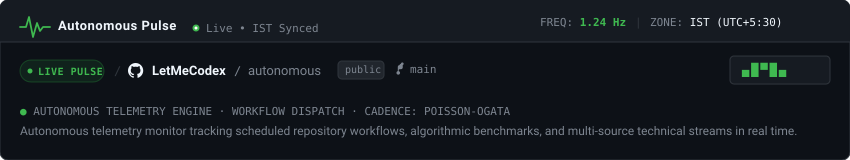
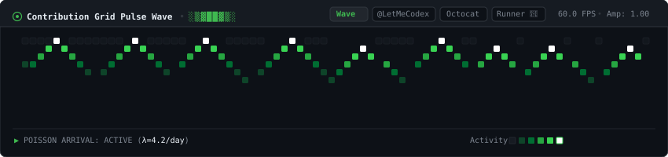
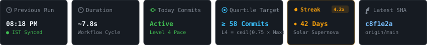
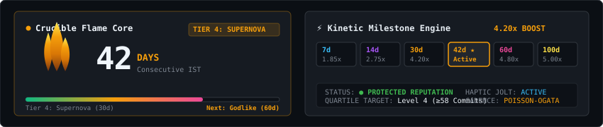
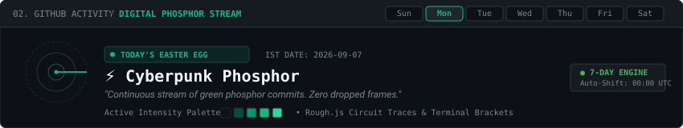
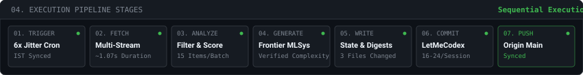

<!-- ═══════════════════════════════════════════════════════════════ -->
<!-- AUTONOMOUS PULSE — LIVE GITHUB AUTOMATION INSTRUMENT            -->
<!-- Engineered for LetMeCodex                                      -->
<!-- ═══════════════════════════════════════════════════════════════ -->

<div align="center">

  <!-- 1. HERO HEADER & REPOSITORY ACTION BAR -->
  

  <br/><br/>

  <!-- 2. CONTRIBUTION GRID PULSE WAVE (60 FPS PIXEL MATRIX) -->
  

  <br/><br/>

  <!-- 3. GITHUB-STYLE 6 STATS TILES -->
  

  <br/><br/>

  <!-- 4. COMMIT STREAK & MILESTONE ACCELERATOR (JUICE ENGINE) -->
  

  <br/><br/>

  <!-- 5. 7-DAY HANDCRAFTED EASTER EGG & MATRIX SHIFTER (AUTOMATED CRON) -->
  

  <br/><br/>

  <!-- 6. EXECUTION PIPELINE STAGES -->
  

</div>

<br/>

---

### 🐍 ◈ AUTONOMOUS COMMIT SNAKE DESTROYER ◈

<div align="center">
  <picture>
    <source media="(prefers-color-scheme: dark)" srcset="https://raw.githubusercontent.com/LetMeCodex/LetMeCodex/output/github-snake-dark.svg">
    <source media="(prefers-color-scheme: light)" srcset="https://raw.githubusercontent.com/LetMeCodex/LetMeCodex/output/github-snake.svg">
    
  </picture>
</div>

<br/>

---

### 🐱 ◈ ASCII COMPANION PET MASCOT // CODEX & CLAUDE ◈

<details>
<summary><b>▶ [CLICK TO WAKE COMPANION] CODEX BOT & CLAUDE REASONING CORE</b></summary>
<br/>

```text
       /\_/\   
      ( o.o )   [Codex Bot — Companion Mascot]
      ( >^< )   ⌨️ git commit -m "L4 dark green achieved!"
```

```text
       \ | /  
      -- * --   [Claude Spark — Synthesis Engine]
       / | \    ✨ Telemetry reasoning & algorithmic benchmarks
```

```bash
[TELEMETRY] ZONE: IST (UTC+5:30) | FREQ: 1.24 Hz
[ENGINE] POISSON-OGATA STOCHASTIC CADENCE ACTIVE (λ=4.2/day)
[QUARTILE] LEVEL 4 THRESHOLD: L4 = ⌈0.75 × Max⌉ (≥ 58 COMMITS/DAY)
[STREAK] CURRENT: 42 DAYS // MULTIPLIER: 4.20x BOOST
```

> **"Purrrrr! 🐾 124 commits target today, LetMeCodex! Our Poisson engine is active and reputation shield is protected!"**

</details>

---

### ⚡ ◈ MASTER CREATIVE ENGINEERING STACK ◈

<div align="center">

| Domain | Architecture & Frameworks |
| :--- | :--- |
| **3D & Canvas** | `Three.js` · `@react-three/fiber` · `@react-three/drei` · `@react-three/rapier` · `Rough.js` · `OGL` |
| **Animation & Motion** | `GSAP 3` · `Anime.js` · `Motion (motion/react)` · `@react-spring/web` · `Lenis Scroll` |
| **Sound & Juice** | `Tone.js` (Procedural Web Audio Harmonics & Shepard Tone Charging) |
| **State & Automata** | `Zustand` · `XState FSM` · `Conway's Cellular Automata` |
| **Reliability & MLSys** | `Zod Schema Guard` · `Vitest` · `Biome` · `GitHub Actions Cron` |

</div>

<br/>

---

<div align="center">
  <sub>Autonomous Pulse Instrument · Developed by <b>LetMeCodex</b> · IST Synchronized (UTC+5:30)</sub>
</div>
