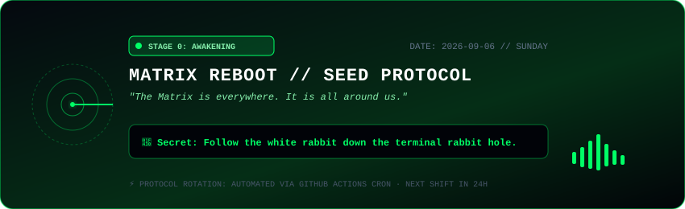
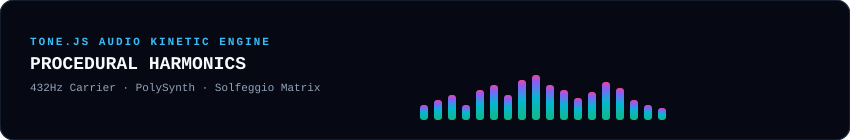

<!-- ◈ MATRIX PROTOCOL PROFILE SYSTEM ◈ -->
<div align="center">

  <!-- 1. ANIMATED MATRIX RAIN BANNER -->
  

  <br/><br/>

  <!-- 2. DAILY AUTOMATED STATUS & EASTER EGG (Updates Every 24H via GitHub Action) -->
  

  <br/><br/>

  <!-- 3. TONE.JS AUDIO SPECTRUM VISUALIZER -->
  

</div>

<br/>

---

### 🕹️ ◈ DAILY MATRIX TERMINAL & HIDDEN EASTER EGGS ◈

<details>
<summary><b>▶ [CLICK TO DECRYPT] ACCESS NEURAL CONSTRUCT & EASTER EGGS</b></summary>
<br/>

```bash
[SYSTEM] INITIATING NEURAL HANDSHAKE...
[OK] BYPASSING MAINFRAME ENCRYPTION
[OK] LOADING MATRIX CORE KERNEL v4.19.0
[OK] GPU COMPUTE RIG: 60 FPS RAPIER DESTRUCTION RIG ONLINE
```

```text
       ___          ___          ___     
      /\__\        /\  \        /\  \    
     /:/  /       /::\  \      /::\  \   
    /:/__/       /:/\:\  \    /:/\:\  \  
   /::\  \ ___  /::\~\:\  \  /:/  \:\  \ 
  /:/\:\  /\__\/:/\:\ \:\__\/:/__/ \:\__\
  \/__\:\/:/  /\:\~\:\ \/__/\:\  \ /:/  /
       \::/  /  \:\ \:\__\   \:\  /:/  / 
       /:/  /    \:\ \/__/    \:\/:/  /  
      /:/  /      \:\__\       \::/  /   
      \/__/        \/__/        \/__/    
```

#### 💊 The Choice
* 🔴 **Red Pill**: You stay in Wonderland, and I show you how deep the WebGL rabbit hole goes.
* 🔵 **Blue Pill**: The story ends, you wake up in your bed and believe whatever CSS framework you want.

```bash
$ cat ~/.bash_profile
export STACK="Three.js + R3F + Rapier + Theatre.js + Motion + Tone.js + Zustand + XState"
export REALITY="Client-Side Rendered"
export SPOON="undefined"

$ echo "Wake up, Neo... 🐰 Follow the white rabbit."
```

</details>

---

### 🐍 ◈ LIVE CONTRIBUTION GRAPH DESTROYER ◈

<div align="center">
  <picture>
    <source media="(prefers-color-scheme: dark)" srcset="https://raw.githubusercontent.com/LetMeCodex/LetMeCodex/output/github-snake-dark.svg">
    <source media="(prefers-color-scheme: light)" srcset="https://raw.githubusercontent.com/LetMeCodex/LetMeCodex/output/github-snake.svg">
    
  </picture>
</div>

<br/>

---

### ⚡ ◈ MASTER CREATIVE ENGINEERING STACK ◈

<div align="center">

| Domain | Weaponry / Frameworks |
| :--- | :--- |
| **3D & Physics** | `Three.js` · `@react-three/fiber` · `@react-three/drei` · `@react-three/rapier` · `Theatre.js` · `OGL` |
| **Motion & Scroll** | `Motion (motion/react)` · `@react-spring/web` · `Lenis Scroll` · `GSAP` |
| **Generative Art** | `Rough.js` · `perfect-freehand` · `Paper.js` · `PixiJS 2D` |
| **Audio Synthesis**| `Tone.js` (FFT Audio-Reactive Shaders & PolySynth) |
| **State & Nodes**  | `Zustand` · `XState FSM` · `@xyflow/react (React Flow)` |
| **Reliability**    | `Zod` · `@tanstack/react-query` · `MSW` · `Vitest` · `Biome` |

</div>

<br/>

---

<div align="center">
  <sub>⚡ Autonomous System Powered by Antigravity · Updated automatically via GitHub Actions Cron ⚡</sub>
</div>
